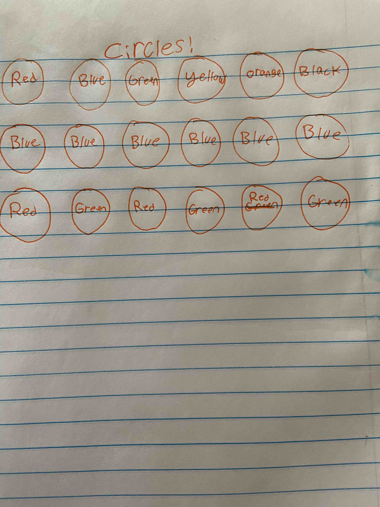

# Make some circles!

Create a 6x3 (6 columns and 3 rows) grid of circles. Make each circle's background color the color written in the picture below:
 
(ex: red should be a completely red circle, no words)

### Acceptance criteria:
* Basic :
  * Make localhost:3000 look like the wireframe above by any means neccesary
* Advanced:
  * Create a reusable component and use it build your UI
* Super Advanced:
  * Create this UI keeping it as DRY (don't repeat yourself) as possible.
 
 
### Stretch Goal:
  * Add an on click function to the circles that will toggle the circle from being completely filled in, to having a white background with the word in the middle of the circle with the font color and border being the color written inside.

Ask me if you have any questions! Good luck!